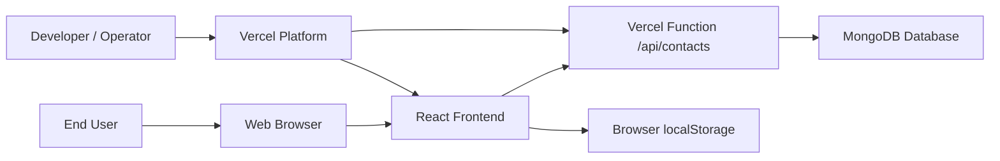
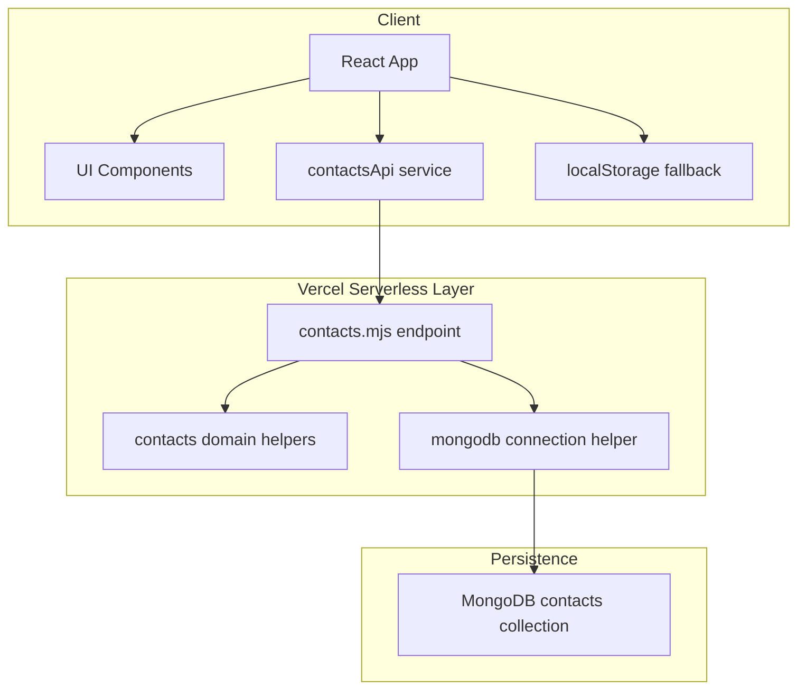
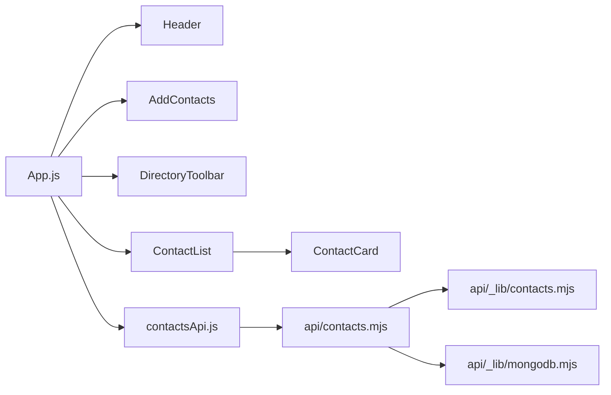
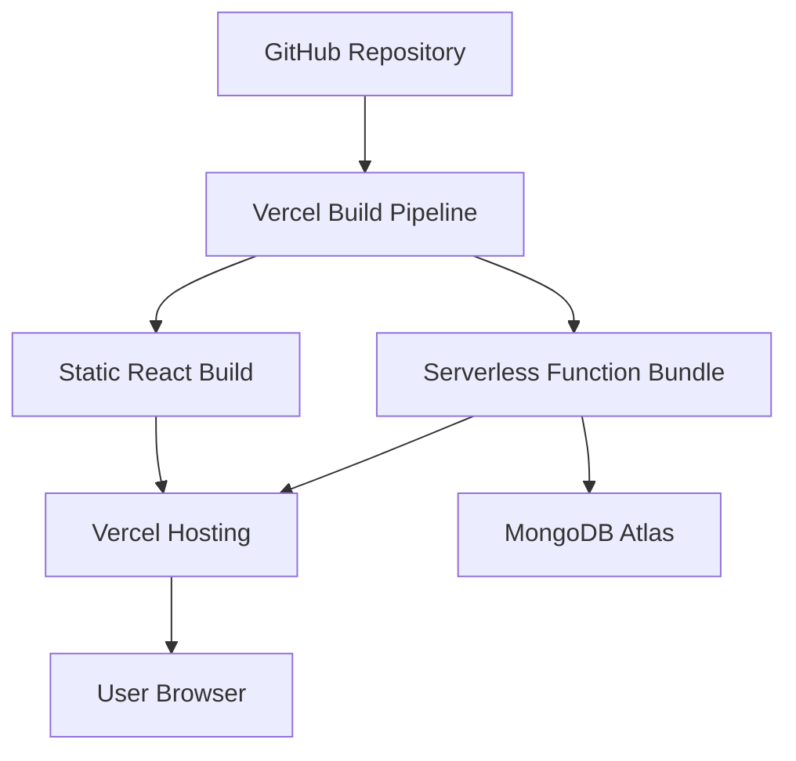

# Architecture Overview

## Purpose

This document describes the end-to-end architecture of Contact Manager, including runtime components, data flow, storage strategy, deployment topology, and system tradeoffs.

## Architectural Style

The solution uses a simple serverless web-application architecture:

- React SPA for presentation and client-side state handling
- Vercel Function for backend CRUD operations
- MongoDB as the system-of-record when configured
- Browser `localStorage` as a resilience fallback

This is intentionally lightweight and optimized for fast deployment and low operational overhead.

## Primary Goals

- Keep the UI simple for end users.
- Minimize backend complexity.
- Support graceful operation even when cloud persistence is unavailable.
- Make deployment straightforward on Vercel.
- Keep the design easy to extend for future features.

## System Context Diagram

## Container Diagram

## Component View

## Deployment Diagram

## Request and Data Flow

### Read Flow

1. The user opens the application.
2. `App.js` requests contacts from `/api/contacts`.
3. The API attempts to read from MongoDB.
4. If the API succeeds, the UI enters cloud mode.
5. If the API fails or returns a setup-related `503`, the UI loads cached contacts from `localStorage`.

### Write Flow

1. The user submits the contact form.
2. The frontend validates the input format.
3. The frontend attempts to create or update through the API.
4. The backend validates, normalizes, and persists the record.
5. If the API call fails with a recoverable error, the frontend writes to `localStorage` instead.

## Persistence Strategy

The application uses dual persistence semantics:

- Primary mode: MongoDB-backed persistence through the Vercel Function
- Secondary mode: `localStorage` fallback to keep the product usable during setup issues or transient backend errors

This design improves resilience but creates an important operational truth:

- data saved in fallback mode is device-specific until the backend is available

## Key Architectural Decisions

### Why React SPA

- small codebase
- simple UI flows
- fast delivery
- low ceremony for form-heavy interactions

### Why Vercel Functions

- native fit for the current deployment platform
- avoids managing a dedicated backend server
- keeps API scope intentionally small

### Why MongoDB

- document shape maps naturally to contact records
- flexible schema for optional fields such as `notes` and `favorite`
- simple fit for serverless CRUD use cases

### Why `localStorage` Fallback

- preserves usability when backend setup is incomplete
- reduces user-facing downtime risk
- useful during initial project bootstrapping and demos

## Non-Functional Considerations

### Availability

- frontend remains usable without cloud persistence
- backend availability depends on Vercel Functions and MongoDB connectivity

### Performance

- low data volume and simple query patterns
- contacts are fetched in a single call
- sorting and filtering are performed client-side

### Security

- currently no authentication or authorization
- MongoDB connection string must remain server-side only
- user data is not protected by per-user isolation in the current design

### Maintainability

- codebase is small and modular
- frontend and backend concerns are separated
- documentation set is now versioned with the source code

## Known Constraints

- all contacts are currently fetched at once
- there is no pagination
- there is no user account model
- there is no audit history
- the app currently uses Create React App instead of a newer bundler stack

## Related Documents

- [Documentation Index](./docs/README.md)
- [High-Level Design](./docs/HLD.md)
- [Low-Level Design](./docs/LLD.md)
- [API Specification](./docs/API_SPEC.md)
- [Data Model](./docs/DATA_MODEL.md)
- [Deployment Runbook](./docs/DEPLOYMENT_RUNBOOK.md)
