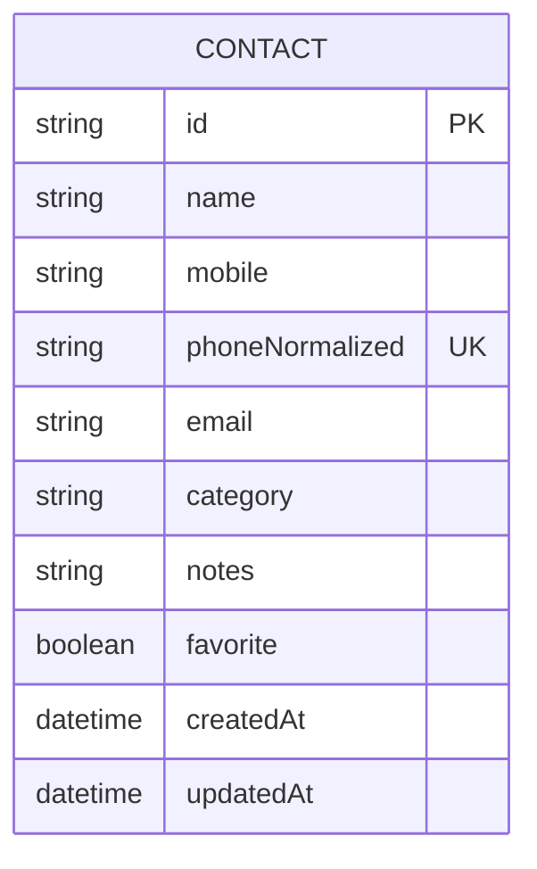
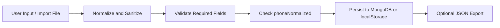

# Data Model

## Overview

The application currently revolves around a single domain entity: `Contact`.

Contacts are stored:

- primarily in MongoDB
- secondarily in browser `localStorage` as a fallback/cache
- optionally in exported JSON backup files

## Entity Relationship Diagram



## Contact Schema

| Field | Type | Required | Description |
| --- | --- | --- | --- |
| `id` | string | yes | application-generated identifier |
| `name` | string | yes | contact display name |
| `mobile` | string | yes | raw mobile number as shown to user |
| `phoneNormalized` | string | yes | digits-plus-normalized value used for deduplication |
| `email` | string | no | email address |
| `category` | string | no | contact category, defaults to `Personal` |
| `notes` | string | no | freeform user notes |
| `favorite` | boolean | no | favorite flag |
| `createdAt` | ISO datetime | yes | creation timestamp |
| `updatedAt` | ISO datetime | yes | last modification timestamp |

## Allowed Categories

Current category set:

- `Personal`
- `Work`
- `Family`
- `Client`
- `Emergency`

## MongoDB Collection Design

### Collection Name

- `contacts`

### Indexes

| Index | Type | Purpose |
| --- | --- | --- |
| `{ phoneNormalized: 1 }` | unique | prevents duplicate mobile numbers |
| `{ updatedAt: -1 }` | standard | supports recent-first retrieval |

## Sample MongoDB Document

```json
{
  "id": "contact-1712345678901-abc123",
  "name": "Priya Nair",
  "mobile": "+91 98765 43210",
  "phoneNormalized": "+919876543210",
  "email": "priya@company.com",
  "category": "Work",
  "notes": "Prefers email updates.",
  "favorite": true,
  "createdAt": "2026-06-03T10:00:00.000Z",
  "updatedAt": "2026-06-03T10:30:00.000Z"
}
```

## `localStorage` Model

### Storage Key

- `contact-dashboard.contacts`

### Legacy Storage Key

- `contacts`

The application reads both keys for backward compatibility, but writes only to the current key.

## Export File Model

The export payload is a JSON object shaped like this:

```json
{
  "version": 2,
  "exportedAt": "2026-06-03T12:00:00.000Z",
  "contacts": [
    {
      "id": "contact-1712345678901-abc123",
      "name": "Priya Nair",
      "mobile": "+91 98765 43210",
      "email": "priya@company.com",
      "category": "Work",
      "notes": "Prefers email updates.",
      "favorite": true,
      "createdAt": "2026-06-03T10:00:00.000Z",
      "updatedAt": "2026-06-03T10:30:00.000Z"
    }
  ]
}
```

## Data Rules

- `name` and `mobile` must exist
- `phoneNormalized` is derived, not user-entered
- timestamps are normalized to ISO strings
- malformed dates are replaced with current time
- duplicate detection uses normalized phone number, not raw formatting

## Data Lifecycle


