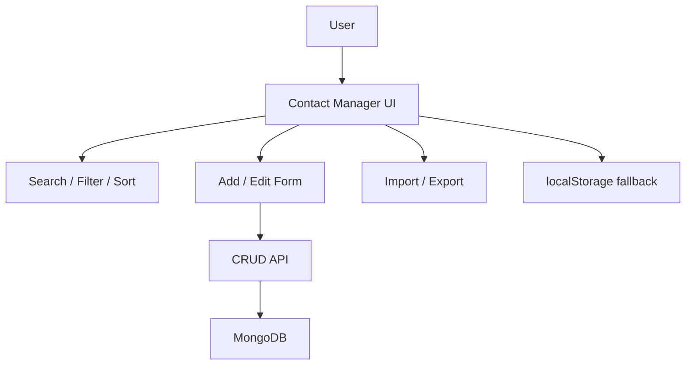
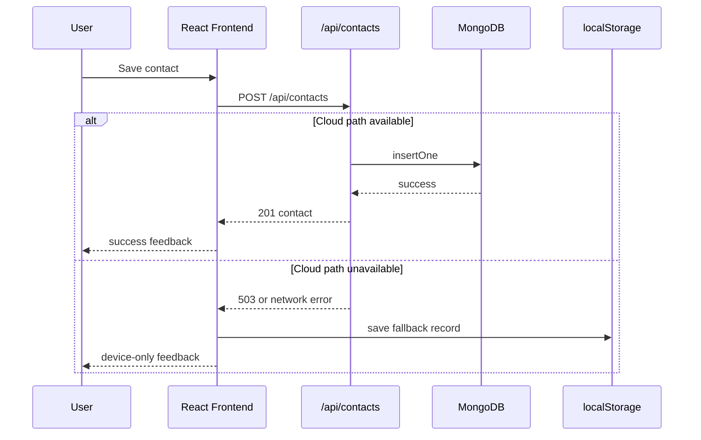

# High-Level Design

## Objective

The goal of Contact Manager is to provide a straightforward contact-management tool with minimal infrastructure complexity and dependable user behavior during setup or backend issues.

## Scope

### In Scope

- create contact
- update contact
- delete contact
- favorite and unfavorite contacts
- search contacts
- category filtering
- sort options
- JSON import and export
- MongoDB-backed persistence
- browser-storage fallback

### Out of Scope

- authentication
- multi-user data isolation
- sharing contacts between users
- role-based access control
- pagination
- analytics
- file attachments

## Stakeholders

- end users managing personal or business contacts
- developers maintaining the frontend and API
- maintainers deploying the project on Vercel

## Top-Level Functional View

## High-Level Modules

### Presentation Layer

- shows contact form
- renders directory list
- provides search, filter, and sort controls
- displays feedback and empty states

### Service Layer

- wraps network calls to `/api/contacts`
- normalizes frontend error handling
- decides whether backend failures are recoverable for fallback mode

### Serverless API Layer

- receives CRUD requests
- validates and sanitizes data
- handles duplicate phone-number detection
- returns normalized responses and status codes

### Persistence Layer

- MongoDB collection for contact storage
- browser `localStorage` as resilience path

## Key User Flows

### Create or Update Contact

1. User enters contact details in the form.
2. Frontend validates required fields and format.
3. Frontend calls the API.
4. API validates and writes to MongoDB.
5. UI refreshes local state from the response.
6. If the backend is unavailable, the frontend stores data locally instead.

### Browse and Search

1. App loads contacts.
2. Contacts are kept in client state.
3. Search, filter, and sort are performed in the browser for responsiveness.

### Backup and Restore

1. Export writes current contacts into a JSON file.
2. Import reads a JSON file.
3. Imported contacts are normalized and deduplicated.
4. Valid contacts are persisted through the backend or locally, depending on availability.

## High-Level Sequence Diagram

## High-Level Data Concerns

- Contact identity is based on a generated string `id`.
- Duplicate prevention is centered on normalized mobile number.
- Contact records support optional fields such as `email`, `notes`, and `favorite`.

## Non-Functional Requirements

### Simplicity

- UI must be understandable to first-time users.
- backend surface area must remain small

### Reliability

- app should not become unusable when MongoDB is unavailable

### Deployability

- should deploy easily on Vercel without managing servers

### Extensibility

- design should allow adding authentication, labels, tags, or pagination later

## Risks and Tradeoffs

- fallback mode can lead to device-local data divergence from cloud data
- fetching the full contact list may not scale to very large datasets
- no authentication means the system is not yet suitable for shared or sensitive production scenarios
