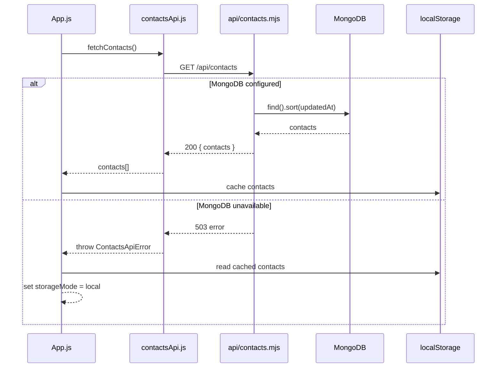
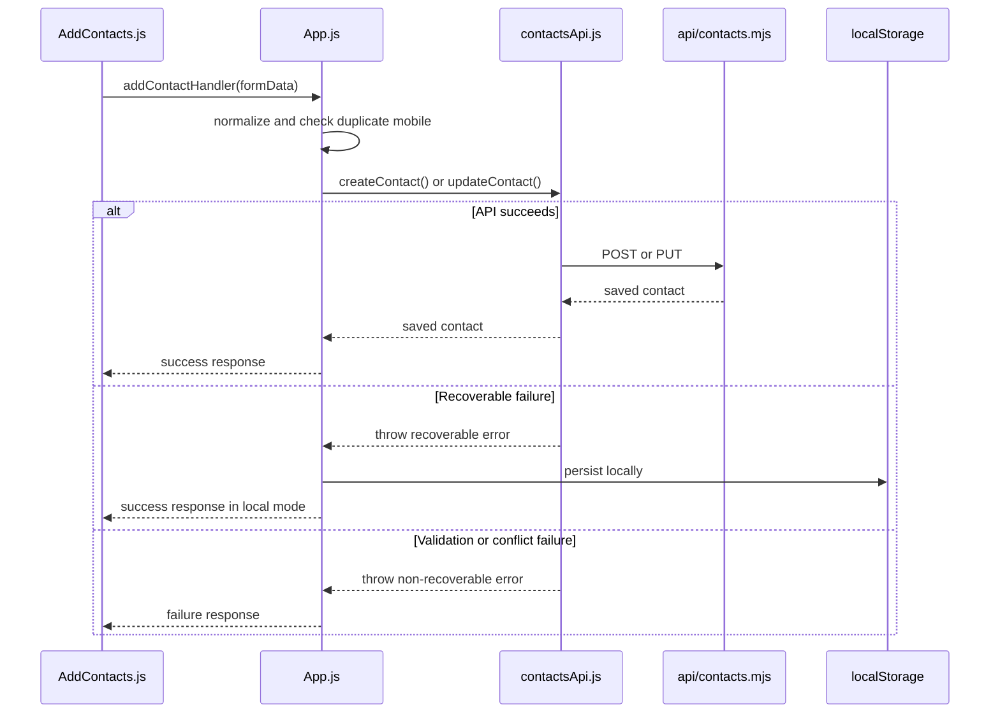
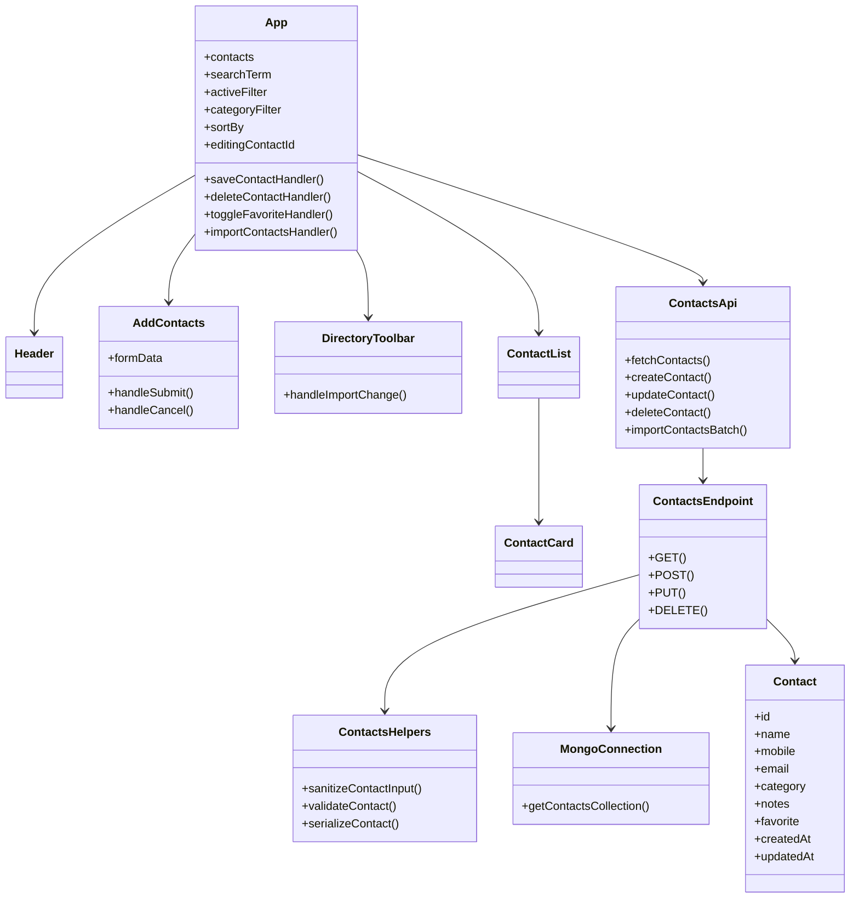

# Low-Level Design

## Objective

This document describes the module-level implementation of Contact Manager, including frontend state orchestration, API handling, validation, and persistence behavior.

## Frontend Module Breakdown

### `App.js`

Responsibilities:

- owns the main contact list state
- owns search, filter, sort, and editing state
- loads contacts on startup
- synchronizes state to `localStorage`
- coordinates API calls and fallback logic
- passes handlers to child components

### `Header.js`

Responsibilities:

- renders product header
- shows contact metrics such as total, visible, favorites, and email count

### `AddContacts.js`

Responsibilities:

- maintains form-local state
- validates name, mobile number, and email format
- supports create and edit modes
- displays local form feedback

### `DirectoryToolbar.js`

Responsibilities:

- renders search input
- renders category and sort selectors
- renders segmented filters
- triggers import and export actions
- shows directory-level feedback

### `ContactList.js`

Responsibilities:

- renders loading state
- renders empty states based on search and filters
- maps contact records to `ContactCard`

### `ContactCard.js`

Responsibilities:

- renders contact summary and details
- exposes edit, delete, and favorite actions
- formats updated date

### `contactsApi.js`

Responsibilities:

- centralizes fetch logic for `/api/contacts`
- wraps API failures in `ContactsApiError`
- decides if a frontend fallback is allowed

## Backend Module Breakdown

### `api/contacts.mjs`

Responsibilities:

- exposes `GET`, `POST`, `PUT`, and `DELETE`
- supports batch import in `POST`
- returns normalized JSON responses
- maps backend errors to HTTP status codes

### `api/_lib/contacts.mjs`

Responsibilities:

- normalizes incoming payload fields
- validates email and mobile format
- generates contact ids
- serializes Mongo documents for API responses
- detects duplicate key errors

### `api/_lib/mongodb.mjs`

Responsibilities:

- initializes and caches `MongoClient`
- selects the MongoDB database
- exposes the `contacts` collection
- creates required indexes
- throws setup-specific `503` error if MongoDB is not configured

## State Model

The main application state is maintained in `App.js`.

| State | Purpose |
| --- | --- |
| `contacts` | in-memory directory records |
| `searchTerm` | live search query |
| `activeFilter` | favorites or has-email filter |
| `categoryFilter` | selected category |
| `sortBy` | active sort option |
| `editingContactId` | contact currently being edited |
| `directoryFeedback` | toolbar-level feedback |
| `storageMode` | `cloud` or `local` |
| `isLoadingContacts` | startup loading state |

## Derived Behaviors

- `filteredContacts` is calculated client-side from `contacts`
- `storageLabel` is derived from `storageMode`
- `editingContact` is derived from `contacts` plus `editingContactId`

## Detailed Flow: Initial Load

## Detailed Flow: Save Contact

## Detailed Flow: Import Contacts

1. User selects a JSON backup file.
2. `DirectoryToolbar.js` forwards the file to `App.js`.
3. `App.js` parses JSON and extracts the `contacts` array.
4. Incoming records are normalized.
5. Invalid or duplicate records are skipped.
6. Frontend tries batch import through the API.
7. On recoverable error, import is applied locally.

## Conceptual Class Diagram

## Validation Rules

- `name` is required
- `mobile` is required
- `mobile` must match `^[+\\d\\s()-]{7,20}$`
- `email` is optional but must be valid if present
- duplicate mobile numbers are blocked using normalized phone values

## Indexing and Lookup Strategy

- unique index on `phoneNormalized`
- descending index on `updatedAt`
- client-side filtering and sorting after full list load

## Extension Points

- add authentication middleware before API handlers
- split contacts by owner or tenant
- add pagination and server-side filtering
- replace CRA with Vite or Next.js
